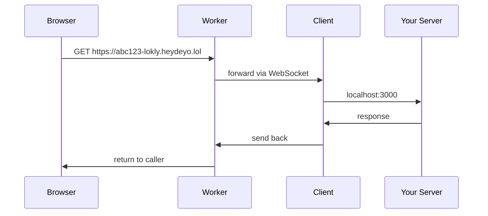

# lokly

Expose localhost to the internet. One command.

```bash
npx @deyoyk/lokly 3000
```

## How it works



Traffic flows over a single WebSocket connection between the client and a
Cloudflare Worker + Durable Object. Requests and responses are sent as compact
binary frames (4-byte JSON length header + JSON metadata + raw body), so the
base64 encoding of plain HTTP is skipped entirely — that cuts Cloudflare
Workers request processing and egress costs per byte of tunneled traffic.

## Usage

```bash
npx @deyoyk/lokly <port> [more ports...]
```

### Options

| Flag | Description |
|------|-------------|
| `--subdomain <name>` | Custom public subdomain (repeatable, pairs with each port). `--subdomain` conflicts return HTTP 409. |
| `--auth <user:pass>` | Basic auth on the public URL (shared across all tunnels in one run). |
| `--timeout <sec>` | Timeout for requests to your localhost app. Default 30s. On timeout the caller gets HTTP 504. |
| `--debug [all\|upstream\|downstream]` | Log frames. `upstream` = client↔server traffic (magenta), `downstream` = client↔localhost traffic (blue). Default `all`. |
| `--inspector-port <port>` | Local request inspector dashboard (default `4040`). `GET /api/requests`, `GET /api/requests/:id`, `POST /api/requests/:id/replay`. |

### Examples

```bash
# Multiple tunnels in one process
npx @deyoyk/lokly 3000 8080

# Custom subdomains (one per port)
npx @deyoyk/lokly 3000 8080 --subdomain api --subdomain admin

# Password-protect the public URL
npx @deyoyk/lokly 3000 --auth user:pass

# Timeout localhost requests after 3 seconds
npx @deyoyk/lokly 3000 --timeout 3

# Debug only client<->localhost traffic
npx @deyoyk/lokly 3000 --debug downstream
```

### Reconnect

If the connection to the server drops, the client reconnects with exponential
backoff (1s → 30s cap, reset after 30s of stability). The same public
subdomain is re-registered on reconnect, so your URL keeps working.

## Developing locally

### Deploy the server

```bash
cd server
npm install
npx wrangler deploy
```

### Publish the client

```bash
cd client
npm version patch
npm publish --access=public
```

### Environment variables

| Variable | Default |
|----------|---------|
| `LOKLY_SERVER` | `wss://lokly.heydeyo.lol/register` |

Override it when testing against your own server:

```bash
LOKLY_SERVER=ws://localhost:8787/register npx @deyoyk/lokly 3000
```

## License

MIT
