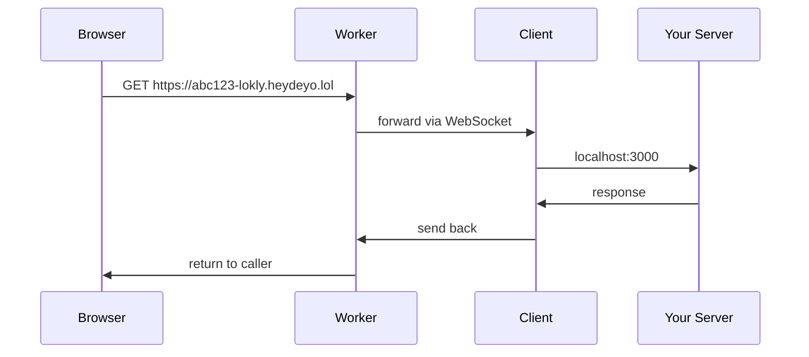

# lokly

Expose localhost to the internet. One command.

```
npx @deyoyk/lokly 3000
```

## How it works



## Commands

| | |
|---|---|
| Use | `npx @deyoyk/lokly <port>` |
| Deploy server | `cd server && npm install && npx wrangler deploy` |
| Publish client | `cd client && npm version patch && npm publish --access=public` |

## Env

`LOKLY_SERVER` — default: `wss://lokly.heydeyo.lol/register`

## License

MIT