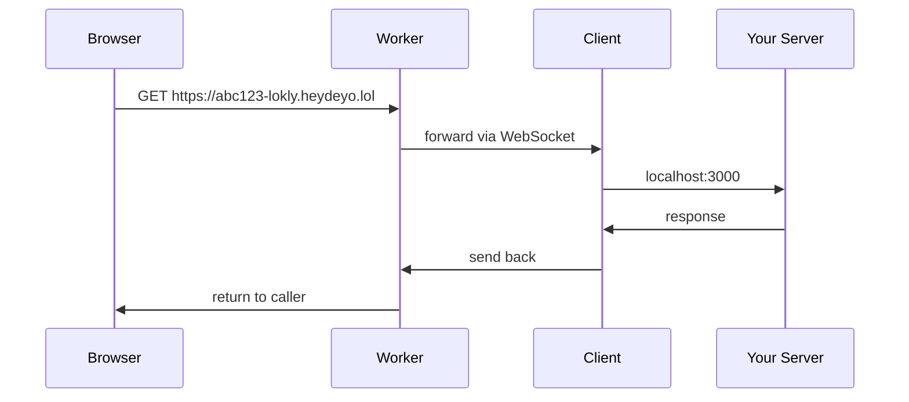

# lokly

Expose localhost to the internet. One command.

```bash
npx @deyoyk/lokly 3000
```

## How it works



## Usage

```bash
npx @deyoyk/lokly <port>
```

## Developing locally

### Deploy the server

```bash
cd server
npm install
npx wrangler deploy
```

### Publish the client

```bash
cd client
npm version patch
npm publish --access=public
```

### Environment variables

| Variable | Default |
|----------|---------|
| `LOKLY_SERVER` | `wss://lokly.heydeyo.lol/register` |

Override it when testing against your own server:

```bash
LOKLY_SERVER=ws://localhost:8787/register npx @deyoyk/lokly 3000
```

## License

MIT
